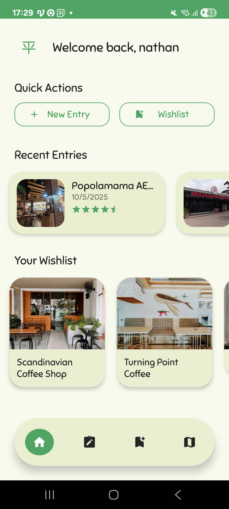
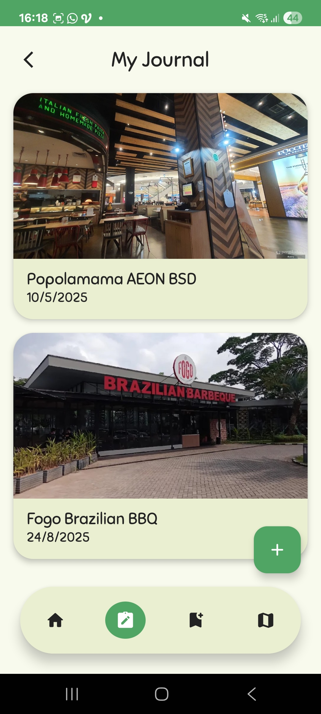
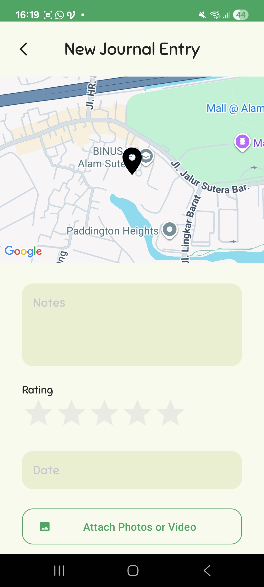
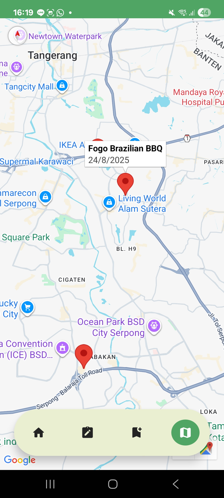
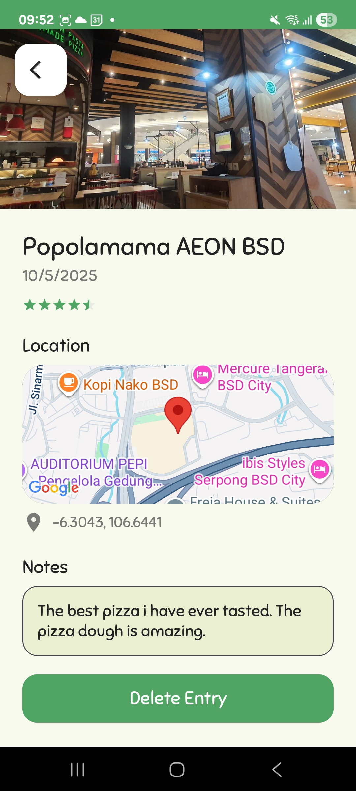
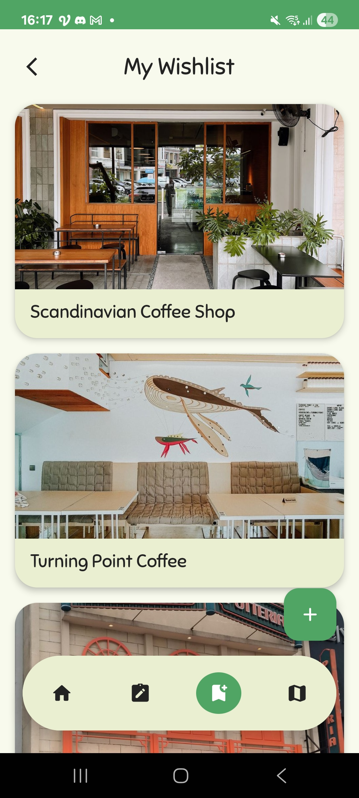

# 📱 Heiwa

An Android app designed to help users document journal entries of places they've visited, as well as keep track of wishlists for places they want to explore in the future.

---

## 🚀 Features

* ✅ Add journal entries with location details and notes.
* ✅ Create and manage travel wishlists.
* ✅ View journal entries directly on an interactive map.

---

## 🛠️ Tech Stack

* **Language:** Kotlin
* **UI:** XML Layouts
* **IDE:** Android Studio
* **Min SDK:** 33
* **Target SDK:** 34

---

## 📂 Project Structure

```
app/src/main
├── java/com/example/heiwa/
│   ├── MainActivity.kt
│   ├── JournalActivity.kt
│   ├── adapter/
│   ├── database/
│   ├── fragment/
│   └── model/
├── res/
│   ├── layout/         # XML layout files
│   ├── values/         # Colors, strings, themes, styles
│   └── drawable/       # Icons, vectors, images
├── AndroidManifest.xml
└── build.gradle
```

---

## ⚡ Getting Started

### Prerequisites

* Android Studio (latest version recommended)
* Kotlin plugin (comes by default with Android Studio)

### Installation

1. Clone the repository:

   ```bash
   git clone https://github.com/nathanielalex/Heiwa.git
   ```
2. Open the project in **Android Studio**.
3. Sync Gradle files.
4. Run the project on an emulator or physical device.

---

## 📸 Screenshots

| Home Page | Journal List Page | New Journal Page |
|:---------:|:-----------------:|:----------------:|
|  |  |  |

| Journal Map Page | Journal Detail Page | Wishlists Page |
|:----------------:|:-------------------:|:--------------:|
|  |  |  |  |
